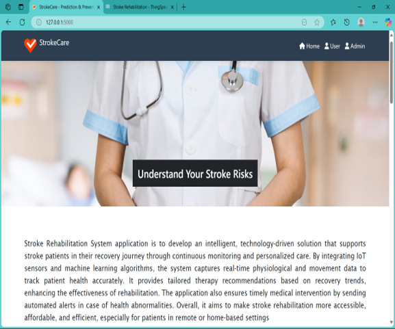
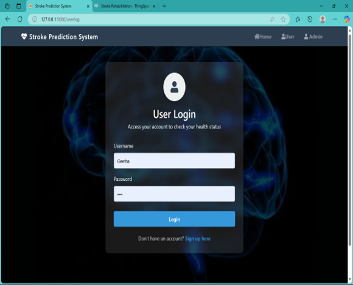
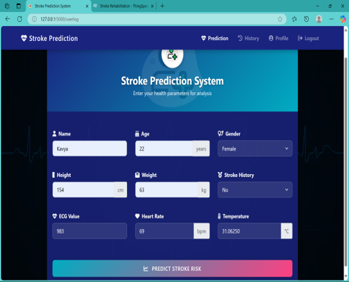
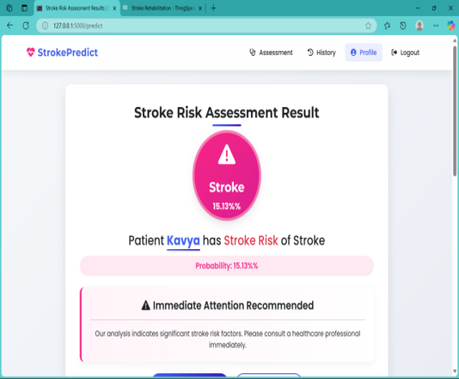
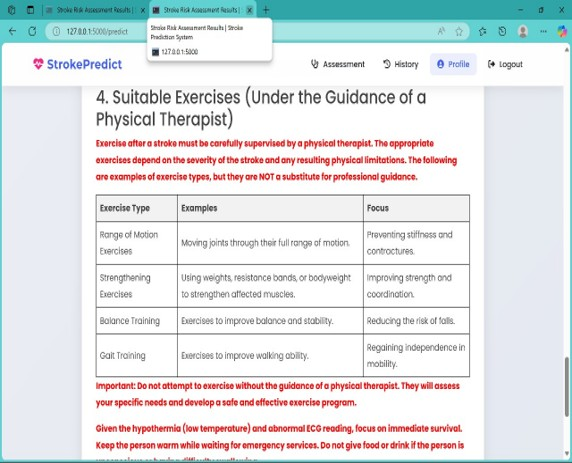
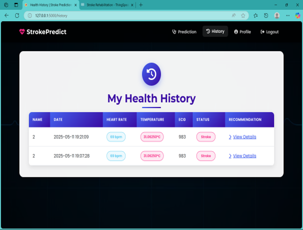
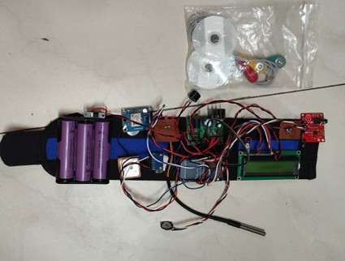

# Enhancing Stroke Rehabilitation using Wearable Sensors and ML-Powered Analytics

## 📌 Project Overview  
Stroke is one of the leading causes of death and disability worldwide. Traditional rehabilitation methods are often limited, costly, and lack real-time monitoring.  
This project introduces an **IoT + ML-powered rehabilitation system** that continuously tracks patient health, analyzes recovery progress, and provides personalized therapy recommendations.

Our solution integrates **wearable IoT sensors, cloud computing, and machine learning** to make stroke recovery more accessible, data-driven, and effective.

---

## 🎯 Objectives  
- Continuous monitoring of vital health parameters using **wearable sensors (ECG, Heartbeat, ADXL345, Temperature)**.  
- Secure **cloud-based storage (ThingSpeak)** for real-time data logging and visualization.  
- **Machine Learning (Weighted KNN)** for stroke prediction, movement classification, and personalized rehabilitation plans.  
- Emergency alert system via **Telegram API** for critical health events.  
- **Web dashboard** for patients, caregivers, and doctors to track recovery progress.  

---

## 🏗️ System Architecture  
1. **IoT Sensor Layer** – ESP32 + ECG, Heartbeat, ADXL345, and Temperature sensors.  
2. **Cloud Layer** – ThingSpeak for real-time data storage and visualization.  
3. **Machine Learning Layer** – Python backend with WKNN algorithm for anomaly detection & prediction.  
4. **Alert Module** – Automated Telegram alerts during emergencies.  
5. **User Interface Layer** – Web app with dashboards, progress tracking, and recommendations.  

---

## ⚙️ Tech Stack  
- **Hardware**: ESP32, ECG Sensor, ADXL345 Accelerometer, Heartbeat Sensor, Temperature Sensor  
- **Software**:  
  - Languages: Python, HTML, CSS  
  - Cloud: ThingSpeak  
  - Database: SQLite3  
  - Libraries: Flask, NumPy, Pickle, ML libraries  
  - Tools: Arduino IDE, Telegram API  

---

## 🚀 Features  
- Real-time patient health monitoring  
- Stroke prediction using **Weighted KNN**  
- Personalized therapy recommendations  
- Emergency alerts through **Telegram bot**  
- Intuitive **web dashboard** for patients & doctors  
- Secure & scalable cloud integration  

---

## 📊 Results  
- Improved monitoring accuracy compared to traditional rehabilitation.  
- Faster intervention through real-time emergency alerts.  
- Adaptive therapy plans leading to **higher recovery rates and patient engagement**.  

---

## 📷 Screenshots  

### 🏠 Web App UI  
  
  

### 📊 Patient Dashboard  
  
  
 
 

### 📡 Hardware Setup  
  

---


## 📌 How to Run  
1. Clone the repository.  
2. Install dependencies:  
   ```bash
   pip install -r requirements.txt
Connect ESP32 and sensors, configure ThingSpeak channel.

3. Run the Flask web app:
   ```bash
   python app.py

5. Access dashboard at http://localhost:5000
